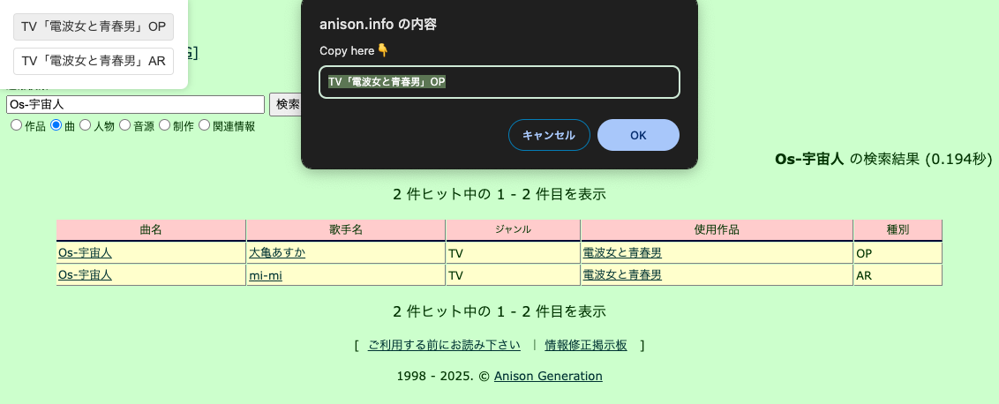

# bookmarklet

## copySongOnAnisonGeneration.js

[Anison Generation](http://anison.info/data/nsearch.html)



```
javascript:import("https://three4c.github.io/bookmarklet/copySongOnAnisonGeneration.js").then(m=>m.default());
```
